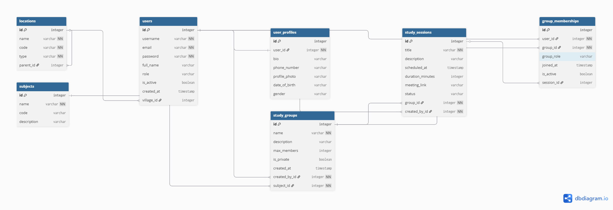

# SmartStudy Group System

SmartStudy is a REST API that allows students to form and manage study groups. 
Students can register, join study groups, attend study sessions, and connect 
with other students studying the same subjects. The system uses Rwanda's 
administrative location structure to organize users by their location from 
Province all the way down to Village.

## ERD
